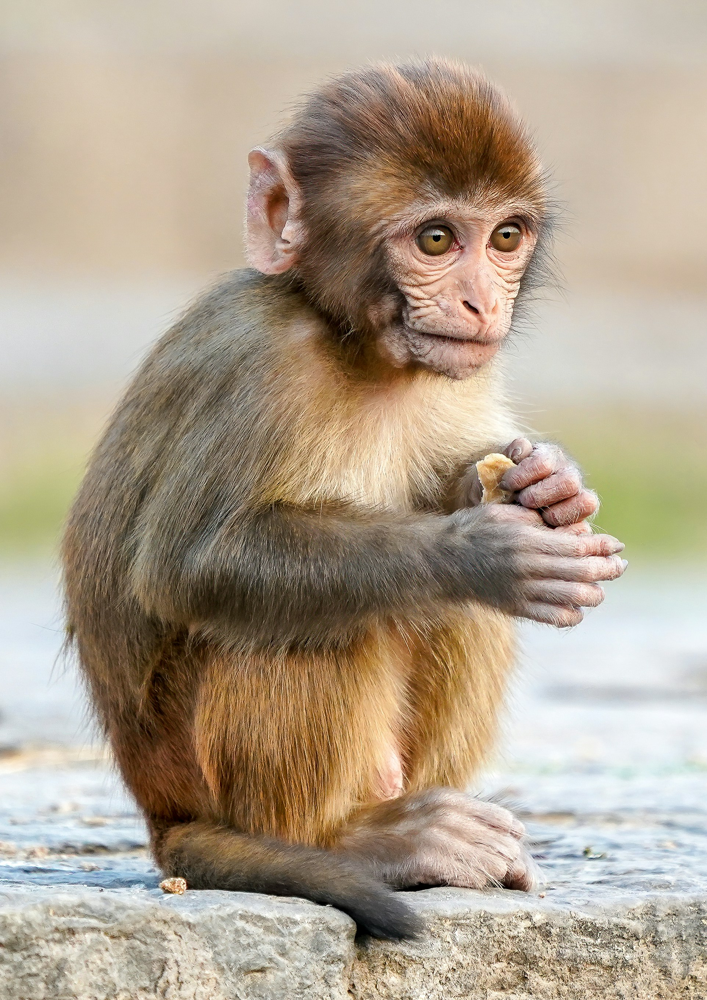
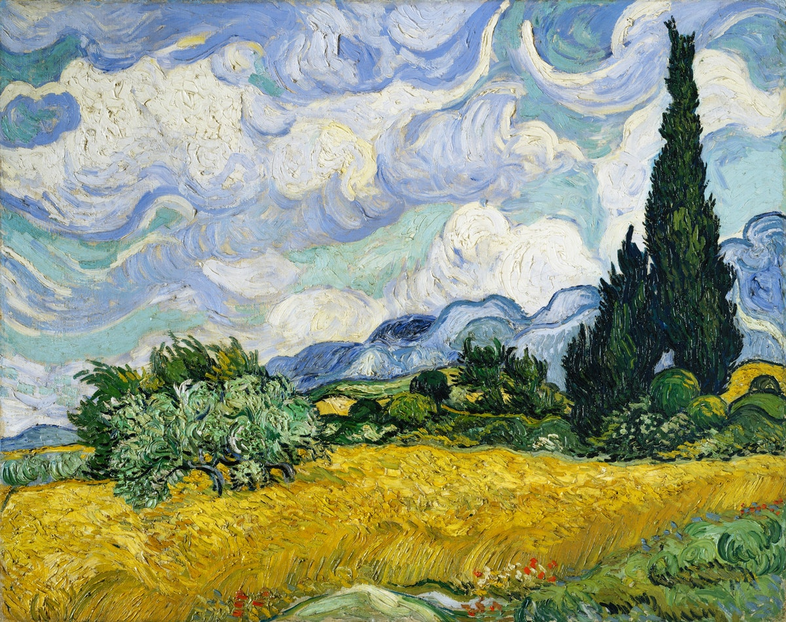

# 🎨 Neural Style Transfer — From Scratch

> **Custom CNN · No Pre-trained Weights**

Implementation of Neural Style Transfer using a fully
custom Convolutional Neural Network — no VGG-19, no ResNet, no transfer learning.
Every component is designed, implemented, and documented from first principles.

---

## Result

| Content Image | Style Image | Generated Output |
|:---:|:---:|:---:|
|  |  |  |

---

## What Makes This Different

Most Neural Style Transfer tutorials use `torchvision.models.vgg19` as a
feature extractor in ~50 lines. This project:

- Designs a custom CNN (`StyleNet`) from scratch with principled architectural choices.
- Implements Gram matrix computation with full mathematical derivation.
- Uses LBFGS pixel-space optimization (not image-space Adam).
- Pre-trains the CNN backbone on CIFAR-10 for semantically meaningful features.
- Includes a complete test suite with mathematical invariance checks.
- Ships a Gradio web demo and CLI in a Dockerized package.

---

## Quick Start

```bash
# 1. Clone and install
git clone https://github.com/your-username/neural-style-transfer
cd neural-style-transfer
pip install -r requirements.txt

# 2. Run style transfer
python main.py \
    --content data/content_examples/city.jpg \
    --style   data/style_examples/vangogh.jpg \
    --config  configs/default.yaml \
    --name    my_first_run

# Output → outputs/runs/my_first_run/final.png

# 3. Quick demo (256px, 150 steps — ~1 min on CPU)
python main.py \
    --content data/content_examples/city.jpg \
    --style   data/style_examples/vangogh.jpg \
    --config  configs/fast.yaml

# 4. Launch the Gradio web app
python app/app.py
# Open http://localhost:7860
```

---
dataset : \
stl10 : 10 classes(500 per class) == 5,000 training images    96*96 \
cifar10 : 10 classes(5000 per class) == 50,000 training images    32*32 \
tiny-imagenet : 200 classes(500 per class) == 1,00,000 training images      64*64 \
coco2017  :   == 1,18,000 images     larger sizes \
imagenette :  10 classes  == 9,000 training images    larger sizes \