# 🎨 Neural Style Transfer — From Scratch

<div align="center">

**Transfer the artistic style of any painting onto your photos — powered by a CNN built entirely from scratch.**

[Overview](#-overview) · [Architecture](#%EF%B8%8F-architecture) · [Loss Functions](#-loss-functions) · [Installation](#%EF%B8%8F-installation) · [Usage](#-usage) · [Experiments](#-experiments) · [Results](#%EF%B8%8F-results)

</div>

---

## 📌 Overview

Neural Style Transfer (NST) is the technique of blending the *content* of one image with the *artistic style* of another. This project implements NST **entirely from scratch** — no pretrained VGG-19, no borrowed backbones.

A custom convolutional neural network is first trained on image classification, and then its learned feature representations are repurposed as a perceptual feature extractor to drive the style transfer optimization loop.

| Content | Style | | Output |
|---|---|---|---|
| 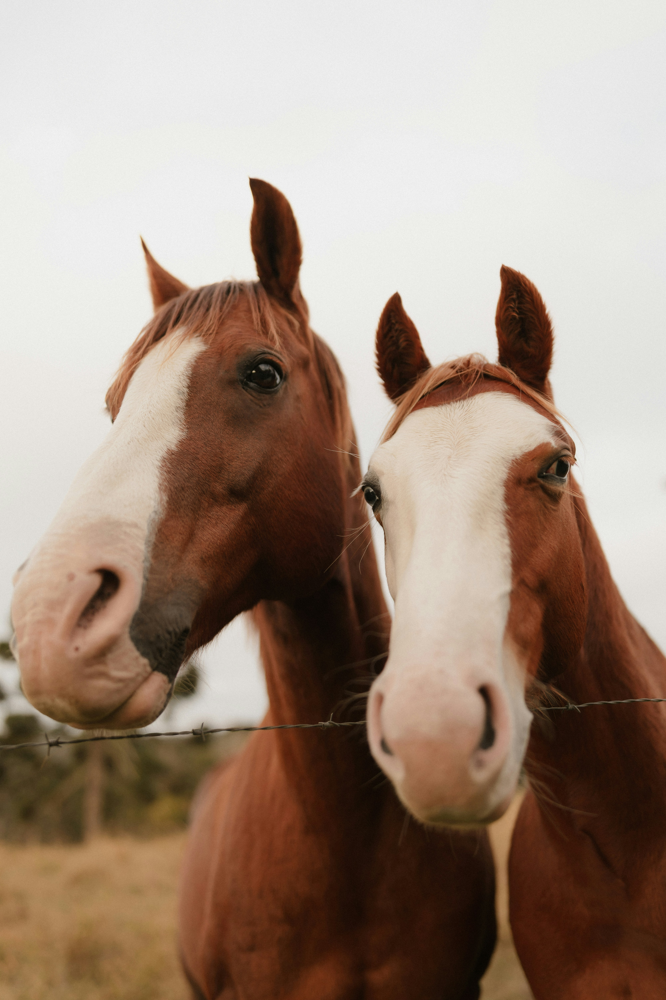 | 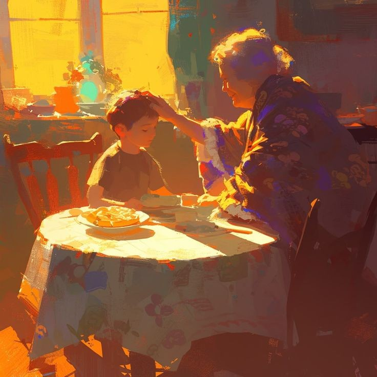 | --> | 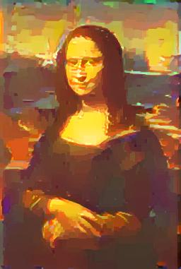 |

### ✨ Key Highlights

| Feature | Detail |
|---|---|
| 🏗️ Custom CNN Backbone | 4-stage feature extractor trained from scratch |
| 🚫 No VGG Dependency | Zero reliance on pretrained VGG-19 networks |
| 🖼️ Gram Matrix Style | Multi-scale texture representation |
| ⚡ LBFGS Optimization | Efficient pixel-level quasi-Newton optimization |
| 🎛️ Config-Driven | 9 YAML experiment configurations |
| 🌐 Streamlit Web App | Interactive UI with live progress |
| 🔬 Multi-Scale Style | Style extracted from multiple network stages |
| 💻 Hardware Flexible | CUDA · Apple MPS · CPU |

---

## 🏛️ Architecture

### Overview

```
┌─────────────────────────────────────────────────────────────────┐
│                        TRAINING PHASE                           │
│                                                                 │
│  [STL-10 / Imagenette] ──► FeatureExtractor ──► Classifier      │
│                                   │          Cross-Entropy Loss │
│                              Checkpoint                         │
│                           (imagenette_backbone.pth)             │
└─────────────────────────────────────────────────────────────────┘
                                   │
                                   ▼
┌─────────────────────────────────────────────────────────────────┐
│                     STYLE TRANSFER PHASE                        │
│                                                                 │
│  Content Image ──┐                                              │
│                  ├──► FeatureExtractor ──► Content Features     │
│  Style Image ───┘        (frozen)      └──► Style Gram Matrices │
│                                                  │              │
│  Generated Image (x) ──► FeatureExtractor ──► Features          │
│         ▲                                        │              │
│         └──────────── LBFGS Optimizer ◄──── Total Loss          │
│                    (pixel optimization)                         │
└─────────────────────────────────────────────────────────────────┘
```

### `FeatureExtractor` — `cnn.py`

A 4-stage convolutional backbone designed for hierarchical feature learning. Each stage progressively doubles the channel count while downsampling spatial resolution.

| Stage | Input Channels | Output Channels | Components |
|---|---|---|---|
| Stage 1 | 3 | 32 | Conv2D → BatchNorm2D → SiLU |
| Stage 2 | 32 | 64 | Conv2D → BatchNorm2D → SiLU |
| Stage 3 | 64 | 128 | Conv2D → BatchNorm2D → SiLU |
| Stage 4 | 128 | 256 | Conv2D → BatchNorm2D → SiLU |

**Design choices:**
- **SiLU activation** — smooth, non-monotonic activation that improves gradient flow over ReLU
- **BatchNorm2D** — stabilizes training and accelerates convergence
- **Kaiming initialization** — appropriate weight initialization for networks with ReLU-family activations
- **Intermediate stage outputs** — each stage's activations are exposed independently for style extraction

### `Classifier` — `cnn.py`

A classification head stacked on top of `FeatureExtractor` for supervised pretraining. After training converges, the classifier is discarded and only the `FeatureExtractor` weights are retained for style transfer.

---

## 📉 Loss Functions

All losses are defined in `losses.py`.

### Content Loss

Measures how well the generated image preserves the spatial structure of the content image using mean squared error between feature maps at a chosen layer:

$$\mathcal{L}_{\text{content}} = \frac{1}{2} \sum_{i,j} \left( F_{ij}^l - P_{ij}^l \right)^2$$

Where $F^l$ is the generated image's feature map at layer $l$ and $P^l$ is the content image's feature map.

### Gram Matrix

The Gram matrix captures texture by computing feature correlation across spatial positions. For a feature map $F \in \mathbb{R}^{C \times H \times W}$, the Gram matrix is:

$$G_{ij}^l = \frac{1}{C \cdot H \cdot W} \sum_k F_{ik}^l \cdot F_{jk}^l$$

This representation is *spatially invariant* — it encodes *what* textures are present, not *where* they are.

### Style Loss

Compares Gram matrices of the generated image against those of the style image, summed across multiple style layers:

$$\mathcal{L}_{\text{style}} = \sum_{l \in \mathcal{S}} \frac{1}{4} \left\| G^l - A^l \right\|_F^2$$

Where $G^l$ is the generated image's Gram matrix and $A^l$ is the style image's Gram matrix at layer $l$, and $\mathcal{S}$ is the set of style layers.

### Total Variation Loss

Promotes spatial smoothness and suppresses high-frequency pixel noise in the generated image:

$$\mathcal{L}_{\text{TV}} = \sum_{i,j} \left[ \left( x_{i,j+1} - x_{i,j} \right)^2 + \left( x_{i+1,j} - x_{i,j} \right)^2 \right]$$

### Total Loss

The three losses are combined with tunable scalar weights:

$$\boxed{\mathcal{L}_{\text{total}} = \alpha \cdot \mathcal{L}_{\text{content}} + \beta \cdot \mathcal{L}_{\text{style}} + \gamma \cdot \mathcal{L}_{\text{TV}}}$$

| Symbol | Role | Default |
|---|---|---|
| $\alpha$ | Content weight | `100.0` |
| $\beta$ | Style weight | `1e9` |
| $\gamma$ | Smoothness weight | `0.001` |

> **Note:** The large ratio of $\beta / \alpha$ is intentional — style transfer requires heavily weighting texture statistics relative to content fidelity.

---

## 📂 Project Structure

```
neural-style-transfer/
│
├── cnn.py                  # FeatureExtractor + Classifier architectures
├── train.py                # Classification training pipeline
├── style_transfer.py       # Core NST optimization loop
├── losses.py               # Content, style, TV, and total loss functions
├── dataset.py              # STL-10 and Imagenette dataset loaders
├── utils.py                # Image I/O, normalization, device detection
├── main.py                 # CLI entry point
├── app.py                  # Streamlit web application
│
├── configs/
│   ├── default.yaml        # 256px baseline configuration
│   ├── default_512.yaml    # 512px high-resolution configuration
│   ├── exp1.yaml           # Experiment 1
│   ├── exp2.yaml           # Experiment 2
│   ├── exp3.yaml           # Experiment 3
│   ├── exp4.yaml           # Experiment 4
│   ├── exp5.yaml           # Experiment 5
│   ├── exp6.yaml           # Experiment 6
│   └── exp7.yaml           # Experiment 7
│
└── checkpoints/
    ├── imagenette_backbone.pth         # Primary trained weights (on imagenette dataset)
    ├── backup_imagenette_backbone.pth  # Backup weights
    └── stl10_backbone.pth              # Weights trained on stl10 dataset

```

---

## 📦 Datasets

Managed in `dataset.py`. Two datasets are supported for training the CNN backbone:

### STL-10

| Property | Value |
|---|---|
| Training images | 5,000 |
| Classes | 10 |
| Resolution | 96 × 96 |
| Source | `torchvision.datasets.STL10` |

### Imagenette

| Property | Value |
|---|---|
| Training images | ~9,000 |
| Classes | 10 (subset of ImageNet) |
| Resolution | 224 × 224 |
| Source | `torchvision.datasets.Imagenette` |

> **Recommendation:** Imagenette is preferred for training. Its higher resolution and greater diversity leads to richer feature representations for style transfer.

---

## ⚙️ Configuration System

All hyperparameters are controlled through YAML configuration files in `configs/`. This makes it easy to reproduce experiments and tune settings without touching source code.

### Example: `configs/default.yaml`

```yaml
IMAGE_SIZE: 256

# Loss weights
ALPHA: 100.0          # Content loss weight
BETA: 1000000000.0    # Style loss weight
GAMMA: 0.001          # Total variation loss weight

# Optimization
NUM_STEPS: 30

# Layer selection
CONTENT_LAYER: stage4

STYLE_LAYERS:
  - stage1
  - stage2
  - stage3
```

### Configuration Parameters

| Parameter | Type | Description |
|---|---|---|
| `IMAGE_SIZE` | `int` | Resolution to resize images to before processing |
| `ALPHA` | `float` | Weight for content loss $\mathcal{L}_{\text{content}}$ |
| `BETA` | `float` | Weight for style loss $\mathcal{L}_{\text{style}}$ |
| `GAMMA` | `float` | Weight for total variation loss $\mathcal{L}_{\text{TV}}$ |
| `NUM_STEPS` | `int` | Number of LBFGS optimization steps |
| `CONTENT_LAYER` | `str` | CNN stage used for content feature extraction |
| `STYLE_LAYERS` | `list[str]` | CNN stages used for style Gram matrix extraction |

---

## 🛠️ Installation

### Prerequisites

- Python 3.9+
- pip or conda
- CUDA-capable GPU (recommended) or Apple Silicon Mac

### Clone and Install

```bash
git clone https://github.com/ayus-commits/Neural-Style-Transfer.git
cd Neural-Style-Transfer

# Create and activate a virtual environment
python -m venv .venv-nst
source .venv-nst/bin/activate        # Linux / macOS
.venv-nst\Scripts\activate.bat         # Windows

# Install dependencies
pip install -r requirements.txt
```

### Verify Device Detection

```bash
python -c "from utils import get_device; print(get_device())"
# Expected: cuda | mps | cpu
```

---

## 🗂️ Dataset Preparation (Not required ,recommended to use saved weights from checkpoint)

The training datasets are downloaded automatically via `torchvision` / the dataset loader.

**For Imagenette** (recommended):

```bash
# The dataset loader will auto-download on first run.
# To manually pre-download to a custom path:
python dataset.py --dataset imagenette --data-dir ./data
```

**For STL-10:**

```bash
python dataset.py --dataset stl10 --data-dir ./data
```

> ⚠️ Dataset files are **not** included in this repository. They will be downloaded on first use.

---

## 🚀 Usage

### Optional(Checkpoint is already saved in ./checkpoints to use directly) — Train the CNN Backbone

Train the `FeatureExtractor` + `Classifier` on image classification. The learned weights are saved as a checkpoint for style transfer.
I have already trained the classifier on my machine and checkpoint is saved.
```bash
# Train on Imagenette (recommended)
python train.py --data imagenette

# Train on STL-10
python train.py --data stl10
```

After training completes, the checkpoint is saved to `checkpoints/imagenette_backbone.pth`.

---

### Method-1 : Web App
### Step 1 — Launch the Streamlit Web App

```bash
streamlit run app.py
```

Then open [http://localhost:8501](http://localhost:8501) in your browser.

#### App Features

- 📤 Upload content and style images via drag-and-drop
- 🎛️ Select experiment configuration from a dropdown
- 🔧 Override hyperparameters ($\alpha$, $\beta$, $\gamma$, steps) with live sliders
- 📈 Real-time loss curve visualization
- 🖼️ Intermediate image preview during optimization
- 💾 Download the final stylized image

---

### Method -2 : CLI
### Step 1 — Run Style Transfer (CLI)

```bash
python main.py \
  --content  images/content.jpg \
  --style    images/style.jpg \
  --config   default \
  --checkpoint imagenette \
  --output-dir ./outputs/ \
  --name     my_run
```

#### CLI Arguments

| Argument | Required | Description |
|---|---|---|
| `--content` | ✅ | Path to the content image |
| `--style` | ✅ | Path to the style image |
| `--config` | ❌ | Name of YAML config file |
| `--checkpoint` | ❌ | Name of trained `.pth` weights |
| `--output-dir` | ❌ | Output directory (default: `outputs/`) |
| `--name` | ✅ | Name for the output run directory |

**Output:**

```
outputs/
└── my_run/
    ├── final_output.jpg        # Final stylized image
    ├── step_001.jpg           # Intermediate frame
    ├── step_002.jpg
    └── ...
```

---

## 🧪 Experiments

Nine configurations are provided to systematically explore the design space of NST:

| Config | `IMAGE_SIZE` | Content Layer | Style Layers | Notes |
|---|---|---|---|---|
| `default.yaml` | 256 | `stage4` | `stage1,2,3` | Baseline |
| `default_512.yaml` | 512 | `stage4` | `stage1,2,3` | High-res baseline |
| `exp1.yaml` - `exp7.yaml` --> experimenting differnet alpha beta gamma values

> Each experiment explores one or more of: content/style layer choice, loss weight balancing, image resolution.

---

## 🖼️ Results

> ℹ️ Output images are not stored in this repository. Run the pipeline to generate your own results.

| Content | Style | Output |
|---|---|---|
|  | 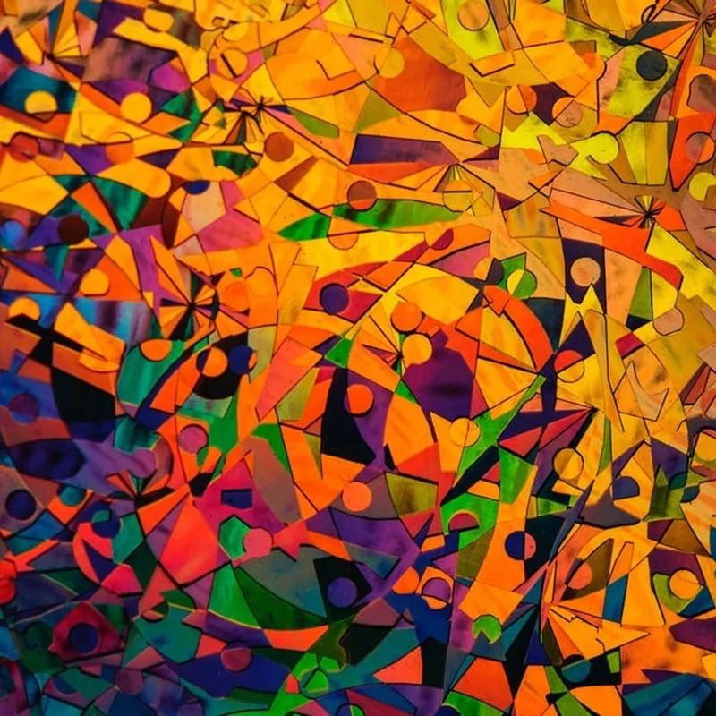 | 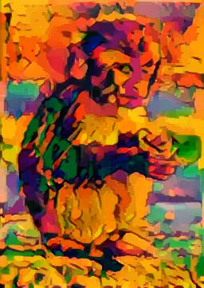 |
|  | 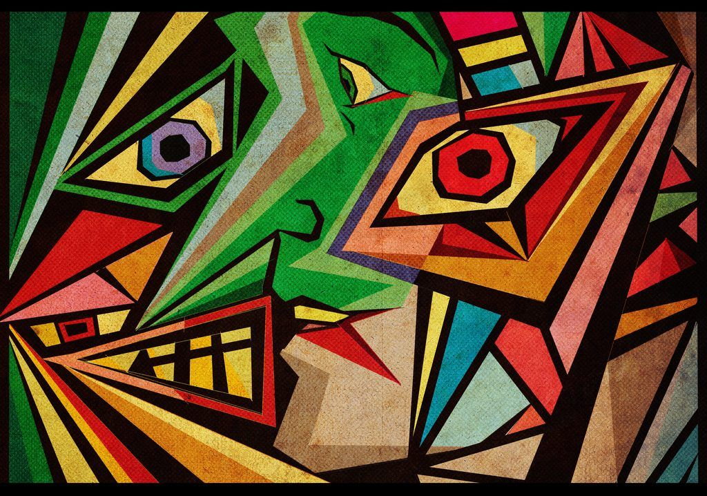 | 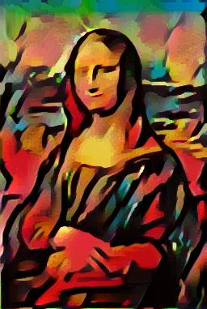 |
|  | 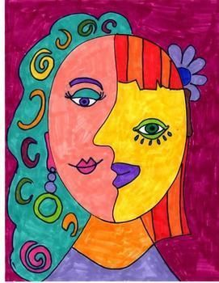 | 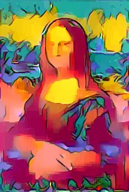 |
|  | 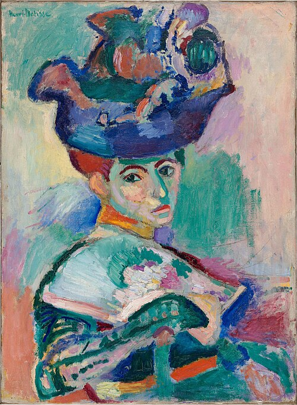 | 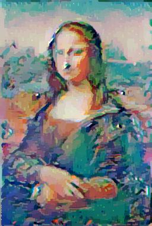 |
|  | 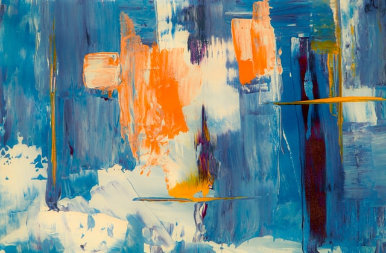 | 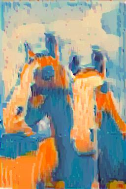 |

**Typical optimization progression (intermediate frames):**

```
Step 0 ──► Step 5 ──► Step 10 ──► Step 20 ──► Step 30 (final)
  (noise)   (rough)    (emerging)   (refined)   (stylized)
```

---

## 🔮 Future Improvements

- [ ] **Faster Style Transfer** — Train a feed-forward stylization network to replace the per-image LBFGS loop
- [ ] **Video Style Transfer** — Apply NST frame-by-frame with temporal consistency loss
- [ ] **Larger Backbone** — Experiment with deeper CNN architectures (ResNet-style residual blocks)
- [ ] **Attention-Based Style** — Explore self-attention layers for spatially-aware style matching
- [ ] **Style Interpolation** — Blend multiple style images with adjustable mix weights
- [ ] **Mixed Precision Training** — Speed up CNN pretraining with FP16/BF16
- [ ] **Evaluation Metrics** — Add quantitative metrics (SSIM, LPIPS) for systematic comparison
- [ ] **Docker Support** — Containerize the full pipeline for reproducible deployment

---

## 🙏 Acknowledgements

- **Gatys et al. (2016)** — [*A Neural Algorithm of Artistic Style*](https://arxiv.org/abs/1508.06576) — the foundational paper that introduced Neural Style Transfer
- **Fast.ai** — for the Imagenette dataset
- **Wikipedia article** -[*Neural Style Transfer*](https://en.wikipedia.org/wiki/Neural_style_transfer)
---

## 📄 License

This project is licensed under the **MIT License** — see the [LICENSE](LICENSE) file for details.

---

<div align="center">

Made with ❤️

</div>
